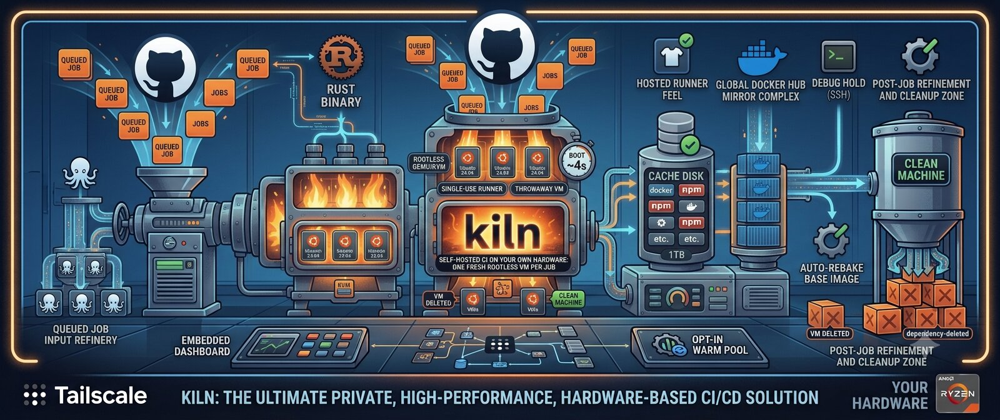

# kiln



Self-hosted CI on hardware you already own: one fresh, rootless QEMU/KVM virtual machine per GitHub Actions job.

kiln is a single Rust binary with an embedded dashboard. It polls GitHub for queued jobs, boots a throwaway Ubuntu 24.04 VM for each one, lets a single-use runner take the job, and deletes the VM afterwards. No root, no tap devices, no runner fleet to babysit.

## Why

- **Your hardware, no minutes.** An always-on Linux box (the reference setup is a Ryzen 7 on a Tailscale tailnet) replaces hosted runner minutes. kiln itself costs nothing to run per job.
- **A clean machine for every job.** Each job gets its own VM with a private copy-on-write disk. Nothing survives the job, so there is no state to leak between runs and no cleanup to forget.
- **Fast enough to feel like containers.** A job VM reaches "runner listening" in about 4 seconds (measured on the Ryzen box), and an opt-in warm pool brings job start-up down to about a second.
- **Hosted-runner feel.** Real Docker, `services:`, `sudo apt install`, nested KVM and the usual `setup-*` actions work, because it is a real VM and not a container.

## Features

- One VM per job, QEMU/KVM with direct kernel boot, on a qcow2 overlay of a frozen base image. Deleting the overlay erases the job.
- Rootless: needs only `/dev/kvm` and QEMU. Runs as a systemd user service.
- JIT runners (single-use, auto-deregistering) so no long-lived registration token sits on disk.
- VM sizes chosen by label: `kiln`, `kiln-2cpu`, `kiln-4cpu`, `kiln-8cpu`, `kiln-16cpu`.
- Demand-based scheduling by queued-job count, with memory, vCPU and disk gates and per-repo failure backoff.
- Per-repo persistent cache disk (Docker layers, npm, cargo, pip, Go, Gradle, Maven) with a trust rule: any job reads it, only a successful push to the default branch (or a configured cache branch such as `dev`) writes it.
- Built-in Docker Hub pull-through mirror, so fresh VMs do not hit Docker Hub rate limits.
- Optional filtered egress: job VMs reach the internet and the mirror only, not your LAN or tailnet.
- Debug hold: a failed job's VM stays up for SSH for a while.
- Optional warm pool of pre-booted idle VMs per repo.
- Embedded dashboard: setup stepper, live console and step logs, job timelines, repo and workflow views, settings, diagnostics.
- Installable as an app (PWA) over Tailscale HTTPS, with its own window, icon and shortcuts. See [Install as an app](docs/configuration.md#install-as-an-app).
- Auto-rebake of the base image when the runner version or image age goes stale, or the baked Node versions change.
- Fork pull requests refused by kiln itself, before any of their code runs.
- Baked Node versions of your choice (`bake_node_versions`) for offline `setup-node`.

## Requirements

- Linux x86_64 with read/write access to `/dev/kvm` (the user must be in the `kvm` group).
- `qemu-system-x86_64`, `qemu-img`, `xorriso`, `curl` and `tailscale` on `PATH` (`kiln doctor` checks them).
- About 15 GB of free disk at a minimum (kiln refuses to launch VMs below that), plus room for the base image, caches and the Docker mirror.
- A GitHub App (created from the dashboard) or a GitHub token that can manage runners on your repos (see [Setup](#setup)).
- The release binary is built on Ubuntu 24.04, so it needs glibc 2.39 or newer (Ubuntu 24.04, Debian 13 or later). To build from source you need Rust 1.89 or newer.
- For filtered egress only: `sudo apt install rootlesskit slirp4netns nftables uidmap util-linux`.
- Experimental, not yet tested on real hardware: an Apple Silicon Mac running arm64 job VMs with Hypervisor.framework. See [docs/apple-silicon.md](docs/apple-silicon.md).

## Quick start

On the CI box.

### Install from a GitHub Release

Two builds are published: `x86_64-linux` (glibc 2.39+, Ubuntu 24.04 / Debian 13 or newer) and `x86_64-linux-musl` (fully static, any x86_64 Linux).

```sh
flavor=x86_64-linux          # or x86_64-linux-musl
v=$(curl -s https://api.github.com/repos/Bunty9/kiln/releases/latest | grep -oP '"tag_name": "v\K[^"]+')
f=kiln-$v-$flavor.tar.gz url=https://github.com/Bunty9/kiln/releases/latest/download
cd "$(mktemp -d)"
curl -fLO "$url/$f" -fLO "$url/$f.sha256"
sha256sum -c "$f.sha256"
tar -xzf "$f"
install -Dm755 "kiln-$v-$flavor/kiln" ~/.local/bin/kiln
install -Dm644 "kiln-$v-$flavor/deploy/kiln.service" ~/.config/systemd/user/kiln.service
kiln --version
```

<details>
<summary>Optional: check the Ed25519 release signature (the same key kiln uses for its own updates)</summary>

```sh
curl -fLO "$url/$f.sig"
printf '\x30\x2a\x30\x05\x06\x03\x2b\x65\x70\x03\x21\x00' > pub.der
printf '%s' zOK6AdHJZXwFqAOUApNnaU7r5PZSCjkpAjLRu2w16ZM= | base64 -d >> pub.der
openssl pkeyutl -verify -pubin -keyform DER -inkey pub.der -rawin -in "$f" -sigfile "$f.sig"
```

</details>

After that, kiln updates itself from the dashboard (Settings › Updates), installing only releases signed with that key.

### Or install from crates.io

The crate is `kiln-ci` (`kiln` is taken there); the binary is still `kiln`. `--root ~/.local` puts it where the service unit expects it.

```sh
cargo install kiln-ci --locked --root ~/.local
v=$(kiln --version | awk '{print $2}')
curl -fsSL "https://raw.githubusercontent.com/Bunty9/kiln/v$v/deploy/kiln.service" \
  | install -Dm644 /dev/stdin ~/.config/systemd/user/kiln.service
```

### Or build from source

```sh
git clone https://github.com/Bunty9/kiln && cd kiln
cargo build --release
install -Dm755 target/release/kiln ~/.local/bin/kiln
install -Dm644 deploy/kiln.service ~/.config/systemd/user/kiln.service
```

### Bake the image and start the service

```sh
kiln doctor        # checks KVM, tools, disk, memory, token, mirror, Tailscale
kiln bake          # one time: Ubuntu 24.04 cloud image + runner, takes about 5 minutes
systemctl --user daemon-reload && systemctl --user enable --now kiln
loginctl enable-linger $USER    # keep running while logged out
```

The unit ([`deploy/kiln.service`](deploy/kiln.service)) runs `~/.local/bin/kiln serve` with `Restart=on-failure` and `KillMode=mixed`. On stop, kiln kills its VMs and deregisters runners that never got a job; leftovers are swept at the next start. You can also bake from the dashboard instead of the CLI.

### Open the dashboard

Open `http://<box>:7878` from your own devices on the tailnet (or users in `allowed_users`). On first run a stepper walks through the token, the base image, a repo and a first job. To get HTTPS (needed for browser notifications), turn on Serve from Settings > Network, which publishes it at `https://<box>.<tailnet>.ts.net:8443`. The tailnet must have HTTPS certificates enabled (Tailscale admin console › DNS › HTTPS Certificates); without them kiln refuses and says so.

### Setup

1. **GitHub token.** kiln looks for `KILN_GITHUB_TOKEN`, then `GITHUB_TOKEN`, then the token saved from the dashboard, then `gh auth token`. A classic PAT needs the `repo` scope (plus `workflow` for the hello PR). A fine-grained token needs *Administration: write* and *Actions: read/write* on each repo (add *Contents* and *Workflows: write* only if you want kiln to open the hello PR). Saving a token checks that it authenticates and reports each repo's runners-API result. Details in [docs/configuration.md](docs/configuration.md#github-token).
2. **Repos.** Add them on the Repos tab as `owner/name`.
3. **Workflows.** Opt a workflow in with `runs-on` (below). The Repos tab can open a PR that adds a small `kiln-hello.yml` workflow for you.

## Using kiln in workflows

```yaml
jobs:
  test:
    runs-on: [self-hosted, kiln]
```

The label picks the VM size. Plain `kiln` gets the default size (`vm_cpus` / `vm_mem_mb`, 4 vCPU and 8 GB unless changed). Add exactly one size label to choose another:

| `runs-on` | vCPU | RAM |
|---|---|---|
| `[self-hosted, kiln]` | `vm_cpus` (4) | `vm_mem_mb` (8 GB) |
| `[self-hosted, kiln-2cpu]` | 2 | 4 GB |
| `[self-hosted, kiln-4cpu]` | 4 | 8 GB |
| `[self-hosted, kiln-8cpu]` | 8 | 16 GB |
| `[self-hosted, kiln-16cpu]` | 16 | 24 GB |

`kiln` is the configurable `label`. Non-default sizes get RAM of min(N x 2 GB, 24 GB); disk is baked into the image (`vm_disk_gb`). A job must name exactly one kiln label: `[kiln, kiln-8cpu]` or `[kiln, gpu]` is not ours and is never picked up. A size larger than the host's thread count is not served either (the job simply waits). A VM registers `kiln-Ncpu`, plus plain `kiln` only when N is the default size, so a big VM never steals a default job.

kiln's own CI ([`.github/workflows/ci.yml`](.github/workflows/ci.yml)) runs this way. For stack compatibility (Node, Python, Go, Rust, Java, Docker, Playwright and more), pricing and migration tips, see [docs/stacks.md](docs/stacks.md).

## Updates

kiln updates itself from signed GitHub releases: Settings › Updates shows when a new version is out, with its release notes. **Update** downloads the release, checks its Ed25519 signature against the key built into kiln, lets running jobs finish (no new VMs start meanwhile), swaps the binary and restarts in place. If the new version fails to start twice, kiln restores the previous one. Set `auto_update` to install new releases on its own when the box is idle. Each release ships a glibc build and a fully static musl build; kiln updates to the same kind it is. Details: [docs/configuration.md](docs/configuration.md#updates).

## Dashboard tour

A first-run stepper takes over until kiln is set up. After that there are four pages:

- **Overview:** health banners only when something needs you (token, image, backoff, rate limit, memory, mirror), one "chamber" per VM slot with live timers, jobs today, failures, median job time and an estimate of minutes saved against GitHub-hosted prices. The Host card splits CPU and memory by job VM and opens into live charts of the last hour.
- **Jobs:** every job VM, filterable. The detail page shows a queue, boot, wait and job timeline, the exit reason, and three log sources: live **console**, live **steps** (the runner's `_diag/pages`, mirrored over a second serial port) and the **GitHub** log once the job finishes. ANSI colour, follow, wrap, copy, download, and a Kill button.
- **Repos:** connected repos, whether jobs actually route to kiln, workflows (with dispatch), recent runs (rerun or cancel), jobs and steps.
- **Settings:** capacity (and pause), timeouts, access, GitHub token, image (rebake, Docker mirror, auto-rebake), cache, debugging, network (egress mode, Tailscale peers, ping, netcheck, HTTPS serve), notifications, diagnostics (the same checks as `kiln doctor`) and updates.

The tab title and favicon show running jobs and unseen failures. Opt-in browser notifications for failed jobs need HTTPS.

## Security model

A job is root inside its own VM, and the dashboard holds a GitHub token, so kiln is built around two boundaries.

- **The dashboard** answers only tailnet peers whose Tailscale identity is the owner of the box (or is listed in `allowed_users`), and the box itself with a secret dashboard key. It checks the `Host` header and requires a custom `x-kiln` header on writes. Job VMs reach the host through QEMU's NAT and look like local traffic, which is why local access needs the key.
- **The VM** is the isolation unit. By default (`egress: "open"`) a job has full outbound network, including your LAN and tailnet, which is fine for your own repos. With `egress: "filtered"` each VM runs in a rootless network namespace with an nftables filter that allows only the public internet, DNS and the Docker mirror. **Switch to filtered before running untrusted pull requests, such as ones from forks.**

The repo cache is a trusted writer with throwaway readers, so a PR can read the cache but never poison it. See [SECURITY.md](SECURITY.md) for the full threat model, the defenses, the known residual risks and how to report a problem.

## Configuration

Settings live in `~/.local/share/kiln/config.json` (override the directory with `KILN_DATA`) and are edited from the dashboard. Everything applies without a restart except `listen` (restart) and `vm_disk_gb` (takes effect at the next bake). The ones you will most likely touch:

| Field | Default | Meaning |
|---|---|---|
| `repos` | `[]` | `owner/name` repos to serve |
| `label` | `"kiln"` | label jobs use in `runs-on` |
| `max_vms` | `2` | VMs at once (0 pauses launching) |
| `vm_cpus` / `vm_mem_mb` | `4` / `8192` | the default VM size |
| `egress` | `"open"` | `"open"` or `"filtered"` |
| `cache` / `cache_gb` | `true` / `30` | per-repo cache disk |
| `docker_mirror` | `true` | Docker Hub pull-through cache |
| `warm` | `{}` | pre-booted idle VMs per repo |
| `debug_hold_mins` | `0` | keep failed jobs for SSH |
| `auto_update` | `false` | install new signed releases when idle |

The full reference (every field, range, live-versus-restart behaviour, environment variables, the data directory layout and CLI commands) is in [docs/configuration.md](docs/configuration.md).

## Known limits

- **Runner updates.** kiln pins the runner version when it bakes. GitHub stops sending jobs to runners much more than a month out of date, so kiln rebakes by itself (`auto_rebake`) once the image is stale.
- **Network throughput.** User-mode networking (slirp) tops out well below line rate and is CPU-heavy on large `docker pull`s. A future option is `passt` (still rootless) or a one-time root setup of tap devices.
- **Runners are per repo.** With a GitHub App, kiln serves every repo the App is installed on, but it registers runners per repo; org-level runner groups are not implemented.
- **Single host, Ubuntu 24.04 guests of the host's architecture** (x86_64; arm64 on Apple Silicon is experimental). Scheduling is a per-repo count; there are no priorities or fair-share.
- **Filtered egress is opt-in.** It is implemented but not yet the default; DNS is not filtered.

## Documentation

| Document | Contents |
|---|---|
| [docs/stacks.md](docs/stacks.md) | Language and tool compatibility, pricing, migration tips |
| [docs/architecture.md](docs/architecture.md) | How kiln works: lifecycle, scheduling, cache, egress, API |
| [docs/apple-silicon.md](docs/apple-silicon.md) | Running kiln on an Apple Silicon Mac (experimental, untested) |
| [docs/configuration.md](docs/configuration.md) | Every setting, environment variable, file and command |
| [CONTRIBUTING.md](CONTRIBUTING.md) | Development setup, tests, deploying |
| [SECURITY.md](SECURITY.md) | Threat model, residual risks, reporting |
| [CHANGELOG.md](CHANGELOG.md) | Release notes |

The base image recipe is [`guest/user-data.yaml`](guest/user-data.yaml) (cloud-init); it is the place to add toolchains your jobs expect. Rebake after changing it.

## License

Licensed under either of Apache License, Version 2.0 ([LICENSE-APACHE](LICENSE-APACHE)) or MIT license ([LICENSE-MIT](LICENSE-MIT)) at your option.

### Contribution

Unless you explicitly state otherwise, any contribution intentionally submitted for inclusion in this project by you, as defined in the Apache-2.0 license, shall be dual licensed as above, without any additional terms or conditions.
